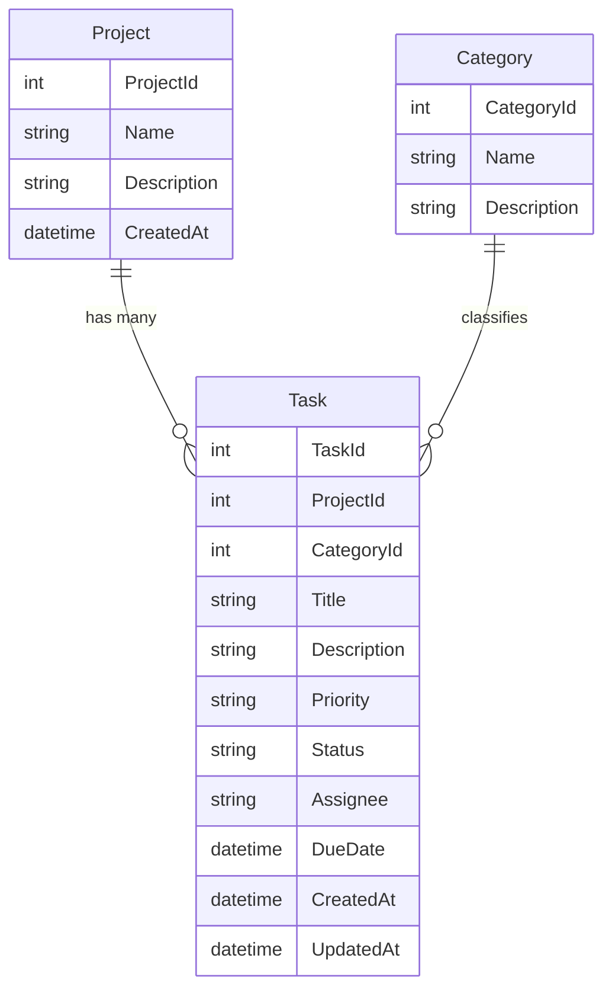

# Developer Task Manager (DTM)
A lightweight task-tracking web application built for developers.

## 📌 Project Overview
The Developer Task Manager helps developers organize their workflow by allowing them to create tasks, assign them to specific projects, and categorize their work. The goal is to keep things simple, structured, and easy to navigate. The application is built with a clean ASP.NET Core MVC architecture, uses SQLite for local data storage, and follows a connected-data design using Entity Framework Core.

## 🛠️ Tech Stack
- **C#**
- **ASP.NET Core MVC**
- **Entity Framework Core (EF Core)**
- **SQLite**
- **Bootstrap 5**

## 🪶 Core Features
- Create and manage **Projects**, **Categories**, and **Tasks**
- Full CRUD functionality across all entities
- Search, filter, sort, and paginate task lists
- Clean, responsive UI built with Bootstrap

## 🚀 Getting Started

### Prerequisites
- **.NET 8.0 SDK** or later

### Installation
1. **Clone the repository**
   ```bash
   git clone https://github.com/TorresjDev/Developer-Task-Manager.git
   cd Developer-Task-Manager
   ```

2. **Restore dependencies**
   ```bash
   dotnet restore
   ```

3. **Run the application**
   ```bash
   dotnet run
   ```
   Access the app at `http://localhost:5000` or `https://localhost:5001`.

## 🗂️ Entity Relationship Diagram (ERD)


## 🗄️ Database & Migrations

### Resetting the Database
If you need to reset the database and migrations:

1. **Delete** the `Migrations/` folder.
2. **Delete** the `DeveloperTaskManager.db` file.
3. **Run commands** to recreate and seed:
   ```bash
   dotnet ef migrations add InitialCreate
   dotnet ef database update
   ```

## ❓ Troubleshooting
- **Build Errors**: Check for missing `using Developer_Task_Manager.Models;` directives.
- **Database Locked**: Ensure the database file isn't open in other tools (like DB Browser) when trying to delete it.

## Apache License
This project is licensed under the Apache License 2.0. See the [LICENSE](LICENSE) file for details.
