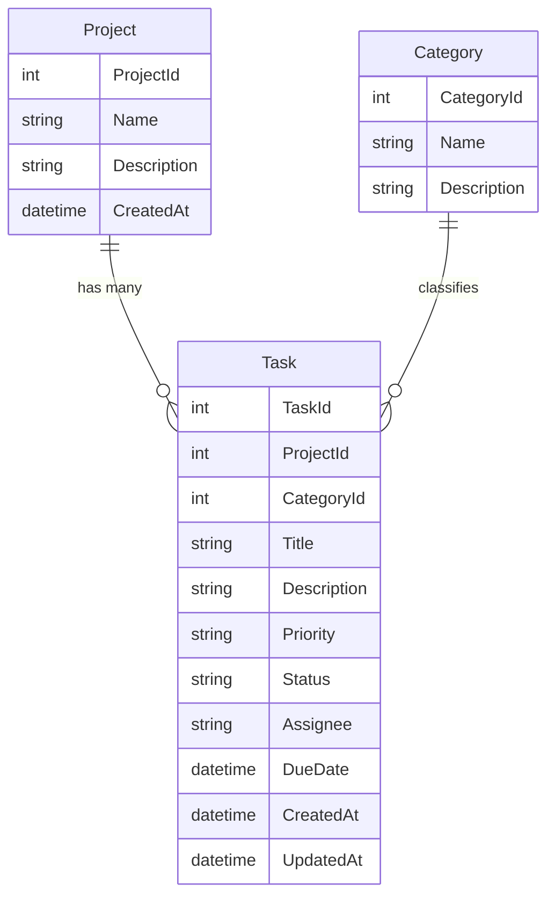

# Developer Task Manager (DTM)
A lightweight task-tracking web application built for developers.

## 📌 Project Overview
The Developer Task Manager helps developers organize their workflow by allowing them to create tasks, assign them to specific projects, and categorize their work. The goal is to keep things simple, structured, and easy to navigate. The application is built with a clean ASP.NET Core MVC architecture, uses SQLite for local data storage, and follows a connected-data design using Entity Framework Core.

## 🛠️ Tech Stack
- **C#**
- **ASP.NET Core MVC**
- **Entity Framework Core (EF Core)**
- **SQLite**
- **Bootstrap 5**

## 🪶 Core Features
- Create and manage **Projects**, **Categories**, and **Tasks**
- Full CRUD functionality across all entities
- Search, filter, sort, and paginate task lists
- Clean, responsive UI built with Bootstrap

## 🗂️ Entity Relationship Diagram (ERD)

## Apache License
This project is licensed under the Apache License 2.0. See the [LICENSE](LICENSE) file for details.
