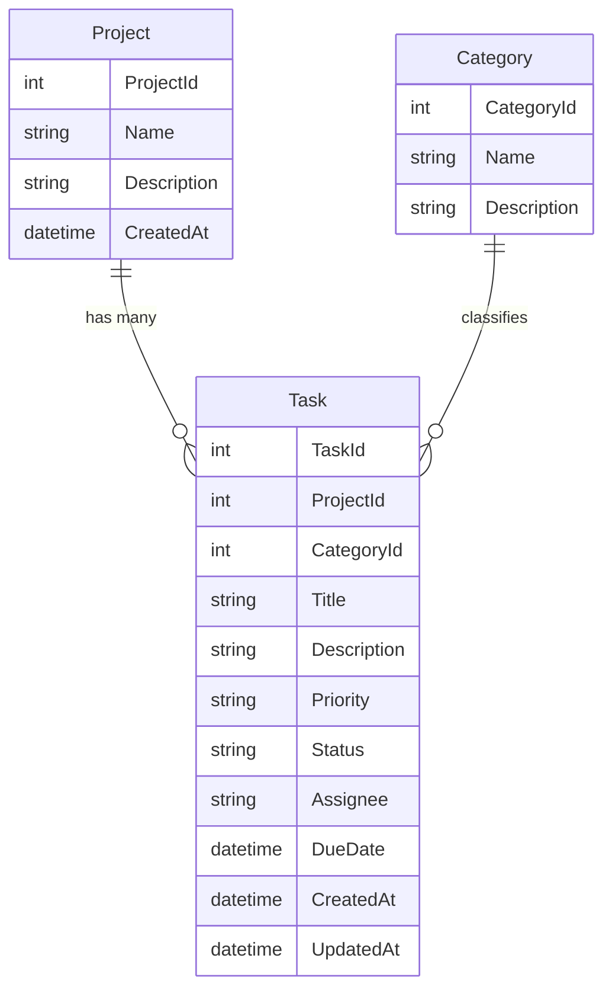

# Developer Task Manager

A streamlined task-tracking application for developers to organize projects, categories, and tasks.

## 📌 Project Overview
The Developer Task Manager helps developers organize their workflow by allowing them to create tasks, assign them to specific projects, and categorize their work. The goal is to keep things simple, structured, and easy to navigate. The application is built with a clean ASP.NET Core MVC architecture, uses SQLite for local data storage, and follows a connected-data design using Entity Framework Core.

### 🌐 Live Demo
*[Launch Developer Task Manager](https://developer-task-manager-torresjdev-g3fvaeg4f2acb6c9.eastus-01.azurewebsites.net/) (Hosted on Azure App Service)*

---

## 📂 Project Structure
```text
Developer-Task-Manager/
├── Models/                 # Database entities (Project, Task, Category)
├── Pages/                  # Razor Pages (UI & Logic)
├── Migrations/             # EF Core database schemas
├── wwwroot/                # Static assets (CSS, JS, Libs)
├── appsettings.json        # Configuration (DB connection strings)
├── Program.cs              # entry point & service registration
└── dtm.db                  # Local SQLite database
```

## 🗂️ Entity Relationship Diagram (ERD)


## 🚀 Key Features
*   **Dashboard**: At-a-glance view of task metrics.
*   **Task Management**: Create, assign, prioritize, and categorize tasks.
*   **Project Organization**: Group tasks by specific projects.
*   **Filtering & Sorting**: Easily find what you need.

## 🛠️ Tech Stack
*   **.NET 8** (ASP.NET Core Razor Pages)
*   **Entity Framework Core** (SQL-based data access)
*   **SQLite** (Lightweight database)
*   **Bootstrap 5** (Responsive UI)

## ⚡ Getting Started

### 1. Installation
```bash
git clone https://github.com/TorresjDev/Developer-Task-Manager.git
cd Developer-Task-Manager
dotnet restore
```

### 2. Run Locally
```bash
dotnet run
```
access at `http://localhost:5000`

## �️ Database Reset
If you need to wipe and restart the database:
1.  Delete the `Migrations` folder.
2.  Delete `dtm.db`.
3.  Run:
    ```bash
    dotnet ef migrations add InitialCreate
    dotnet ef database update
    ```

## ⚖️ License
Licensed under the [Apache License 2.0](LICENSE).
